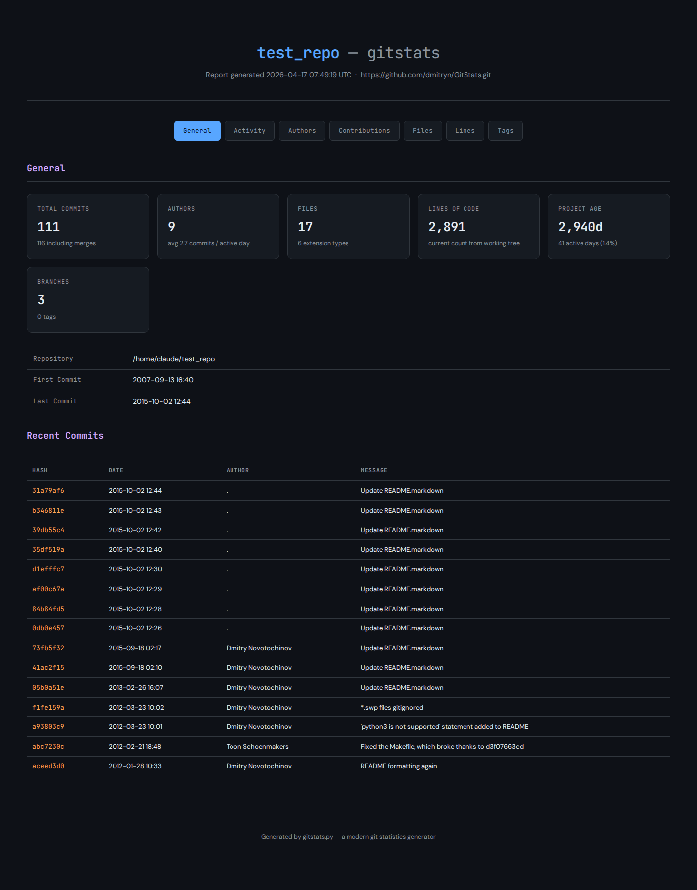
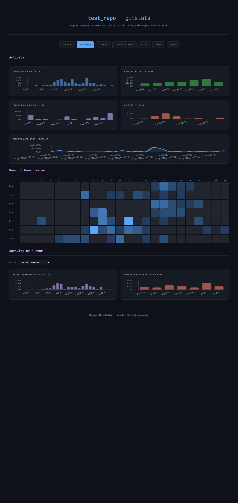
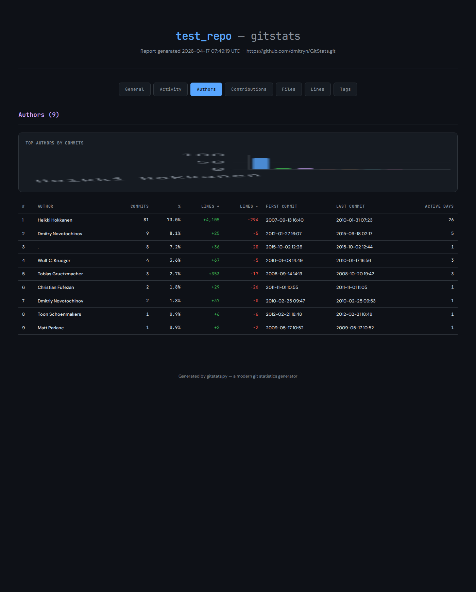
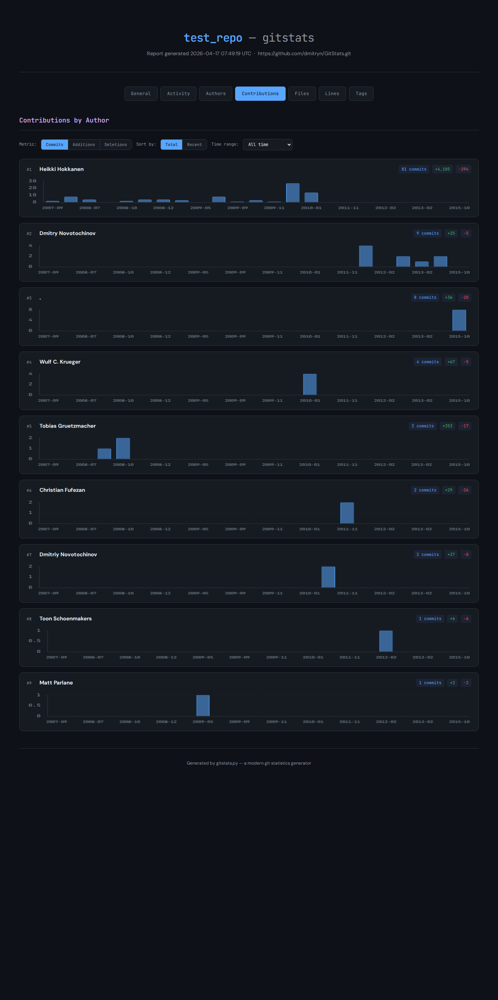
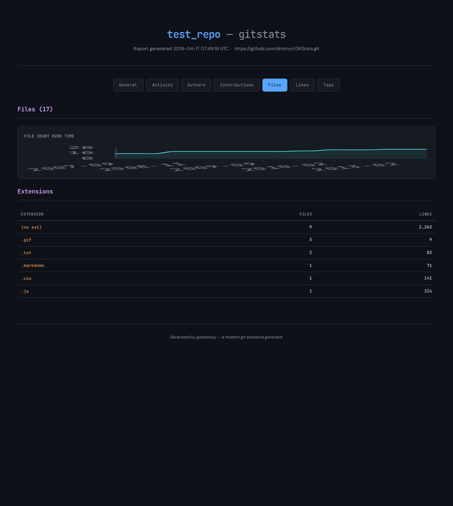
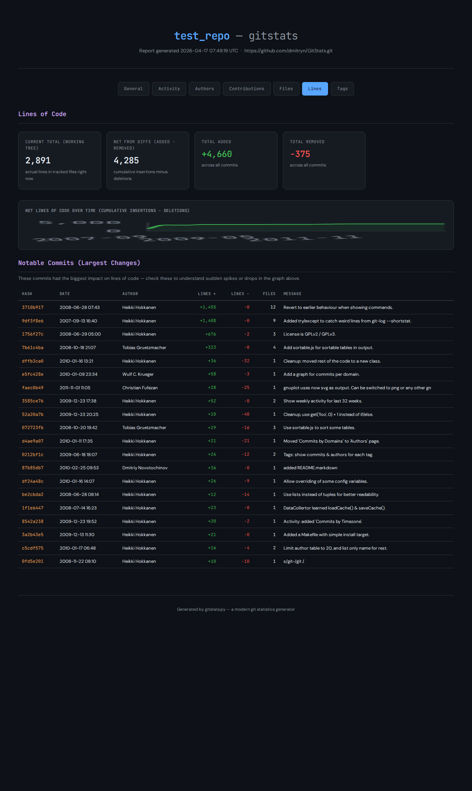

# gitstats

A modern git repository statistics generator. Analyzes any git repo and produces a **self-contained HTML report** with interactive charts and detailed statistics — no server, no dependencies beyond Python 3 and git.

## Features

- **General** — commit counts, authors, files, lines of code, project age, recent commits
- **Activity** — commits by hour/day/month/year, monthly timeline, hour-of-week heatmap
- **Authors** — ranked table with insertions/deletions, first/last commit, active days
- **Contributions** — per-author bar charts with metric (commits/additions/deletions), sort, and time-range filters
- **Files** — file count over time, extension breakdown with line counts
- **Lines** — net LOC over time (cumulative insertions − deletions), notable large commits
- **Tags** — tag list with dates

All charts are interactive (Chart.js). The output is a single `index.html` — no external assets required at viewing time (fonts/Chart.js load from CDN).

## Requirements

- Python 3.7+
- Git in `PATH`

## Usage

```bash
python3 gitstats.py <git_repo_path> [output_directory]
```

```bash
# Analyze current repo, write to ./gitstats_report/
python3 gitstats.py .

# Analyze a specific repo, write to custom directory
python3 gitstats.py ~/projects/myapp ~/Desktop/myapp-stats

# Then open the report
open gitstats_report/index.html       # macOS
xdg-open gitstats_report/index.html  # Linux
start gitstats_report\index.html      # Windows
```

## Output

A single `index.html` file in the output directory. Open it in any modern browser.

## Screenshots

<details>
<summary>General — summary stats and recent commits</summary>



</details>

<details>
<summary>Activity — hour/day/month charts and heatmap</summary>



</details>

<details>
<summary>Authors — ranked table with commit and line stats</summary>



</details>

<details>
<summary>Contributions — per-author monthly bar charts with filters</summary>



</details>

<details>
<summary>Files — file count over time and extension breakdown</summary>



</details>

<details>
<summary>Lines — net LOC over time and notable large commits</summary>



</details>

## License

MIT
